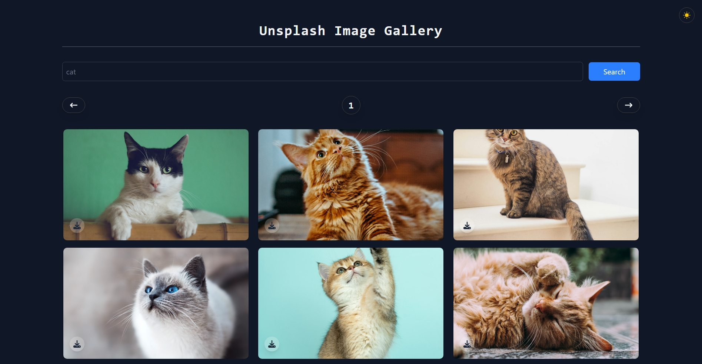

# Unsplash Images App

A React application that fetches and displays images from the Unsplash API based on user search input. The app features a dark/light theme toggle and pagination for browsing through multiple pages of images.

## Live Demo

[Unsplash Images App](https://images-unsplash-app.netlify.app/)

## Screenshots




## Features

- Search for images using keywords.
- View images in a responsive grid layout.
- Download images directly from the gallery.
- Scroll to top button for easy navigation.
- Dark and light theme toggle for better user experience.
- Pagination to navigate through different pages of search results.

## Tech Stack

- **React**
- **Tailwind CSS**
- **Unsplash API**
- **React Query**
- **Axios**
- **React Icons**

## Getting Started

1. Clone the repository:
   ```bash
   git clone https://github.com/Abdelaziz-Mohammed/unsplash-images-app.git
   ```
2. Navigate to the project directory:
   ```bash
   cd unsplash-images-app
   ```
3. Install the dependencies:
   ```bash
   npm install
   ```
4. Start the development server:
   ```bash
   npm run dev
   ```
5. Open your browser and go to `http://localhost:3000` to view the app.

## Environment Variables

Create a `.env` file in the root directory and add your Unsplash API access key:

```bash
VITE_UNSPLASH_ACCESS_KEY=your_access_key_here
```

## 👨‍💻 Author

**Eng. Abdelaziz Mohamed**

- [LinkedIn](https://www.linkedin.com/in/abdelaziz)
- [GitHub](https://github.com/Abdelaziz-Mohammed)
